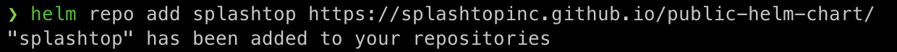
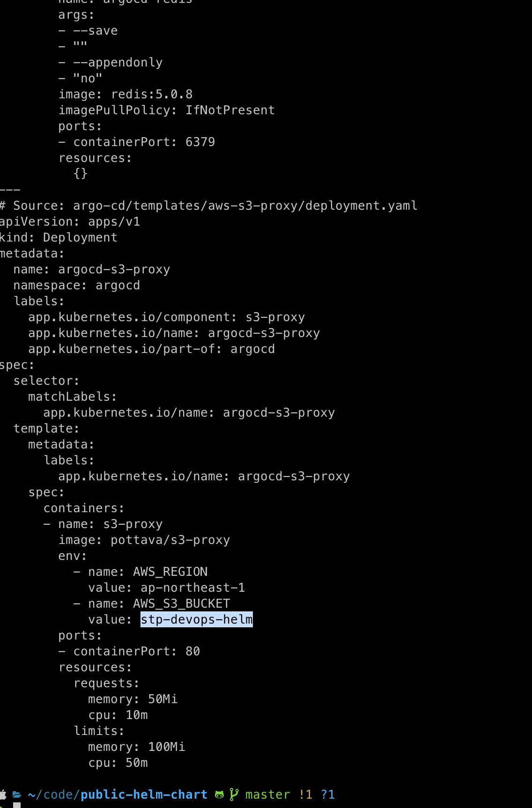
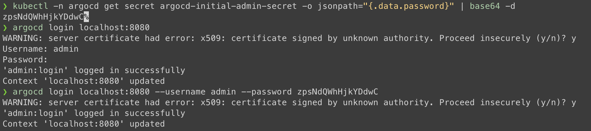
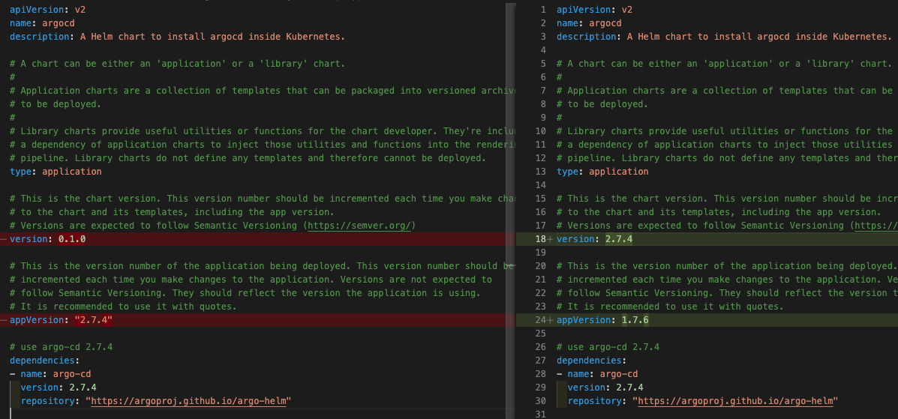
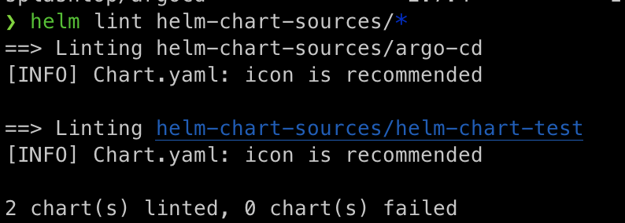
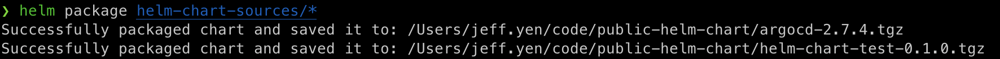
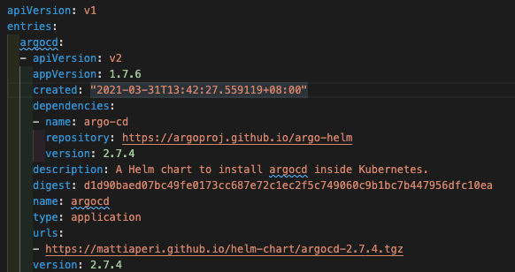
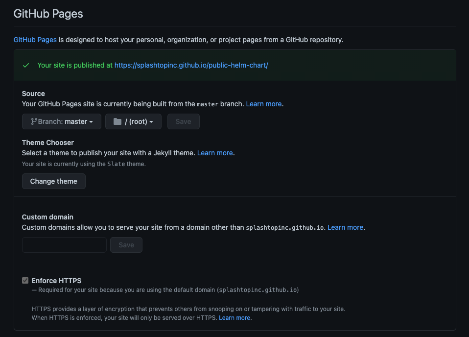

# How to use this chart repo

## Add the splashtop helm repo

```
helm repo add splashtop https://splashtopinc.github.io/public-helm-chart/
```


## helm 

```
# --dry-run
helm install argocd splashtop/argo-cd -n argocd --dry-run

# install 
helm install argocd splashtop/argo-cd -n argocd  --create-namespace

# upgrade
helm upgrade argocd splashtop/argo-cd -n argocd 

```


## Port Forwarding

Kubectl port-forwarding can also be used to connect to the API server without exposing the service.

```
kubectl port-forward svc/argocd-server -n argocd 8080:443
```

The API server can then be accessed using the localhost:8080

## Login Using The CLI

*Argo CD v1.9 and later*

The initial password for the admin account is auto-generated and stored as clear text in the field password in a secret named argocd-initial-admin-secret in your Argo CD installation namespace. You can simply retrieve this password using kubectl:

```
kubectl -n argocd get secret argocd-initial-admin-secret -o jsonpath="{.data.password}" | base64 -d
```

For better readability, e.g. if you want to copy & paste the generated password, you can simply append && echo to above command, which will add a newline to the output.

Using the username admin and the password from above, login to Argo CD's IP or hostname:   
argocd login <ARGOCD_SERVER>  # e.g. localhost:8080 or argocd.example.com   

```
argocd login localhost:8080
or
argocd login localhost:8080 --username admin --password zpsNdQWhHjkYDdwC
```


***

***

# Create a public Helm chart repository with GitHub Pages

## Create a helm chart from scratch (or copy your own)
As a pre-requisite of this stage, you need to have the Helm CLI installed and initialized. Please find here the instructions in case you haven’t install Helm client yet.

use the directory ./helm-chart-sources/ for the sources of our charts. You might want to copy into ./helm-chart-sources/ your charts instead:

```
mkdir ./helm-chart-sources && cd ./helm-chart-sources/

helm create helm-chart-sources/helm-chart-test
```

## modify the chart.yaml

ensure the chart version and app version


## Lint the chart

```
helm lint helm-chart-sources/*
```


## Create the Helm chart package
```
helm package helm-chart-sources/*
```


## Create the Helm chart repository index

According to [Helm](https://helm.sh/docs/topics/chart_repository/#create-a-chart-repository)

A chart repository is an HTTP server that houses an index.yaml file and optionally some packaged charts. When you're ready to share your charts, the preferred way to do so is by uploading them to a chart repository.

```
helm repo index --url https://splashtopinc.github.io/public-helm-chart/ --merge index.yaml .
```


### Add the Helm chart to an existing repository

Whenever you need to add a new chart to the Helm chart repository, it’s mandatory for you to regenerate the index.yaml file. The $ helm repo index command will completely rebuild the index.yaml file from scratch, including only the charts that it finds locally, which very likely is our case. However, it worth notice that you can use the --merge flag to incrementally add new charts to an existing index.yaml:

```
helm repo index --url https://splashtopinc.github.io/public-helm-chart/ --merge index.yaml .
```

## Push the git repository on GitHub

```
git add . && git commit -m "argocd chart version update" && git push origin master
```

## Configure the repository as a Github pages site



***

Ref:   

https://medium.com/@mattiaperi/create-a-public-helm-chart-repository-with-github-pages-49b180dbb417

https://helm.sh/docs/topics/chart_repository/#create-a-chart-repository